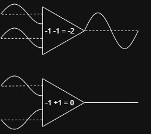
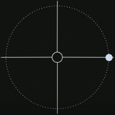
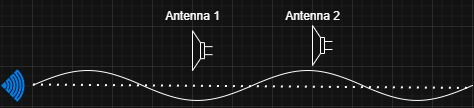
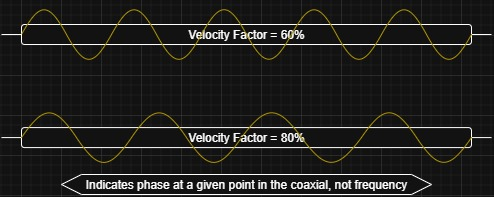

# Introduction
Turnstile antennas are a collection of dipoles phased together as an array to create polarization, all using one axis.  
They are not the easiest antenna to make, though with the help of some tools, construction can become easier.

The premise of turnstiles - and any phased array - is the addition of multiple weaker signals to create one stronger signal.  

⚠ **Note:** While phasing is not the complete picture, and other factors influence gain like element spacing and array factor.

---

## Phase
In order to benefit from receiving the same signal from multiple sources, the signals need to be combined.  

- If two signals are perfectly **in phase**, they are additive.
- If the two signals are **180° out of phase**, they cancel each other out.
- If they are phased anywhere in between, distortion occurs — reducing amplitude and creating a “muddy” signal.  

This phase offset also affects the **radiation pattern**, potentially making an *elliptical* polarization.

---

### Phase Related to Polarization
In a 3D space, circular polarization could be represented like a helix.  
If we flatten this to two dimensions and use time as the third, we can illustrate how a circularly polarized signal might be received by a simple cross dipole *without* phasing.

⚠ **Note:** While not a perfect demonstration, this shows that the signal received by each element reaches the receiver at a different point in time.  
Given that these appear as waves, and a signal “pulse” represents one phase point, a mismatch will cause partial or full cancellation if signals are not synchronized.

---

## Coaxial Cables
We can use coax cables to create a delay in signal, since electromagnetic waves take time to propagate (travel) through any medium.

Most coaxial cables list a **Velocity Factor** (VF) or **Velocity of Propagation** (Vp) - the fraction of the speed of light in a vacuum at which a signal travels in the cable. Most coax falls between **60%** and **85%**.

When creating phase lines, VF becomes vital:  
- Two coaxial cables of equal length but different VF will deliver the signal at different times.
- One full **360° phase change** equals one wavelength, but in coax the wavelength is reduced by VF:  

If we precisely measure coax length, we can delay signals so that, when they converge, they are in sync.

We can compare this to the [non-phased example](#phase-related-to-polarization): with proper delay, both signals reach the receiver in phase, adding to amplitude.

---

## Tips for Making Phased Turnstile Antennas

### Use Coax with a High Velocity Factor
Since a full 360° phase shift requires more *physical* length with higher VF, you can afford slightly larger measurement errors.  
Example:  
- Coax with **60% VF** → ~1° error per cm
- Coax with **80% VF** → ~0.75° error per cm

Here is a [Coax Phase Length Calculator](https://moddermax.github.io/Turnstile/calculator.html) to find the length of coax for a given frequency and phase. 

⚠ The example above is not all-inclusive. It was calculated at 50mhz; wavelength decreases as frequency increases.
⚠ The calculator does not include the phase of added connectors. From my experience, a pair of male SMAs add ~25mm @ 100% VF, or about 2.5° per connector at 137mhz.

### Aim for using in VHF or lower frequency ranges.
The higher the frequency, the shorter your phase lines must become and thus the smaller your margin of error will be. Turnstiles really aren't applicable above VHF bands, and phased arrays at higher frequencies are usually designed with RF phase shifters and controllers.

### Use connectors to your advantage
Separating each part of the design process can be helpful. I have found that using SMA-F connectors to the elements, I can have multiple sets of phase lines and test each one, or easily swap the phase lines around to reverse the polarization.

---

# Circularly Polarized Turnstiles
Circular polarization can be achieved by:
- **Element geometry** (e.g., QFH, asymmetric turnstile)
- **Delays** (phase lines)

---

## Axial Turnstile & Crossed Yagi-Uda
The classic axial-mode turnstile uses a pair of dipoles at a 90° offset.  
Polarization can be switched between **LHCP** and **RHCP** by changing which dipole is delayed by 90°.

⚠ **Note:** Just like dipoles can use directors and reflectors, so can turnstiles.

---

## Asymmetric Turnstile
An asymmetric turnstile does not use phase lines. Instead, it uses angled elements to emulate circular polarization.  
⚠ **Note:** This often results in *elliptical* polarization rather than perfectly circular polarization.

---

## Quad-Feed Turnstile
A test of the limits of how many elements can be phased together. This is a turnstile design that I have made; though not entirely efficient, it has displayed promising results. 

--- 

## Double Turnstile
The double turnstile is two sets of turnstiles on two points of one axis.